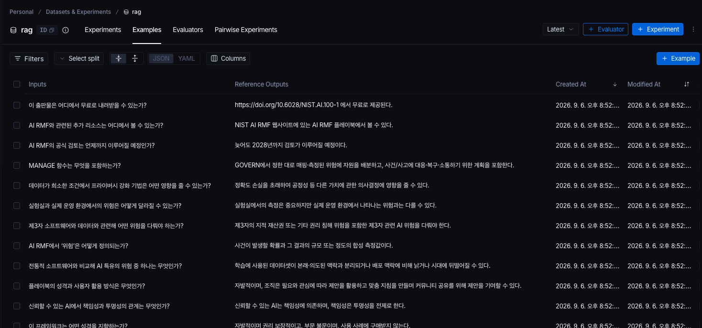
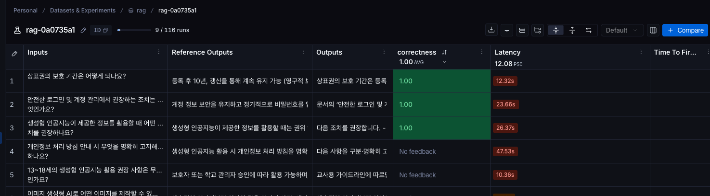
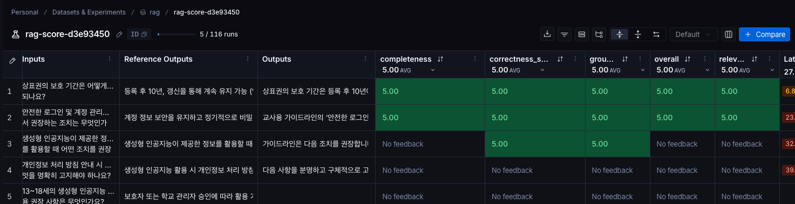
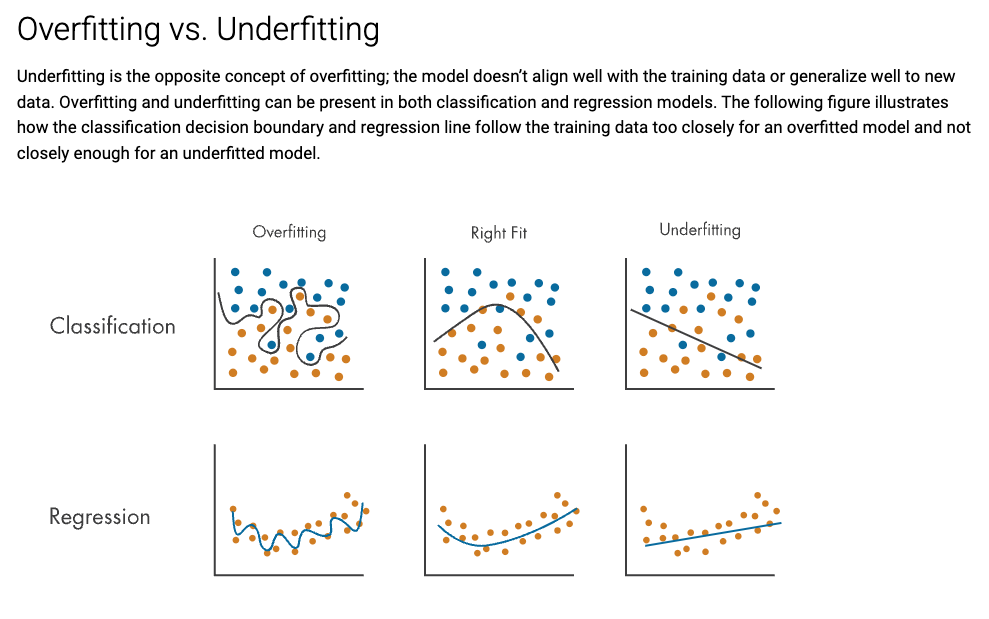

```shell
npm run rag:upload
```



```shell
npm run rag:eval
```



```shell
npm run rag:eval:score
```



---

## Source

- https://www.nist.gov/publications/artificial-intelligence-risk-management-framework-ai-rmf-10?utm_source=chatgpt.com
- https://www.goe.go.kr/goe/na/ntt/selectNttInfo.do?mi=10961&nttSn=1056901&utm_source=chatgpt.com

### Do not aim for a 100% score on the golden dataset

The goal of evaluation is not to make every golden example pass.
The golden dataset is only a small sample that stands in for real usage.
If you keep tuning the prompt and the system until every example scores perfectly, the system ends up fitted to those specific examples — this is overfitting.
Eventually you will reach a result that satisfies the entire golden dataset, but it can still produce wrong answers for cases outside of it, and at that point the score can no longer warn you about them.

Treat the score as a signal for finding weaknesses, not as a target to maximize. Keep adding fresh failure cases from real usage to the dataset, so that it keeps measuring generalization rather than memorization.

- https://www.mathworks.com/discovery/overfitting.html

